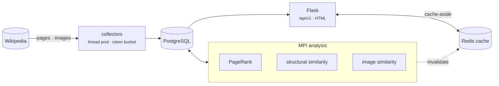
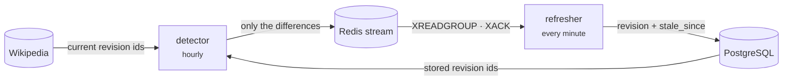

# Tourist Recommendations

[](https://github.com/MikeSoroka/tourist-recommendations/actions/workflows/ci.yml)

A Flask + PostgreSQL service over Wikipedia-derived places of interest for
Berlin, Copenhagen, Vilnius and Sydney. MPI batch jobs compute a PageRank over
the pages' link graph and two kinds of similarity between places; a JSON API and
a small web UI serve the results, with Redis caching the read paths.

Built as the final project for the Big Data course at Kaunas University of
Technology (KTU), where the MPI-distributed analysis was the core requirement;
the API, caching, freshness pipeline and packaging were added afterwards to take
it from a coursework submission to a deployable service.

<p align="center">
  
</p>
<p align="center"><sub>Sydney ordered by PageRank over the Wikipedia link graph; every photo is the article's own lead image.</sub></p>

## Architecture

**Data pipeline** — collection, analysis and serving.



**Freshness loop** — keeps the snapshot current without re-scraping.



Two images come out of one Dockerfile: `runtime` carries only what the web
app and the sync workers need; `tools` adds MPI, OpenCV and scikit-learn for
the collection and analysis jobs, which run as one-off `docker compose run`
commands rather than long-lived services.

## Quickstart

```bash
cp .env.example .env          # set DB_PASSWORD
docker compose up --build
```

Then create the schema and collect a city:

```bash
docker compose run --rm web python -m tourist.collection.db_setup
docker compose --profile tools run --rm collector python -m tourist.collection.collect all --city Berlin
```

`db_setup` creates the database, runs `alembic upgrade head`, and seeds the
cities from `config.CITIES`.

The API is on http://localhost:8000/api/v1 and the UI on http://localhost:8000.

<p align="center">
  
</p>
<p align="center"><sub>Sydney Opera House: the article's gallery, neighbours by article structure, and neighbours by dominant colour.</sub></p>

## API

| Method | Path | Notes |
|---|---|---|
| GET | `/api/v1/cities` | cached |
| GET | `/api/v1/cities/{id}/places` | `?sort=`, `?limit=`, `?offset=`; cached |
| GET | `/api/v1/places/{id}` | detail with images and categories |
| GET | `/api/v1/places/{id}/similar` | structural and image-based neighbours |
| GET | `/api/v1/categories` | cached |
| GET | `/api/v1/health` | liveness |
| GET | `/api/v1/ready` | readiness; 503 when the database is unreachable |

`sort` accepts `wiki_relevance`, `pagerank`, `pageviews` and `title`. Paginated
responses carry a `pagination` object with `total`, `limit` and `offset`.

Errors use one envelope, with a machine-readable code:

```json
{"error": {"code": "invalid_sort", "message": "sort must be one of: ..."}}
```

## Concurrency

The collectors are bound by Wikipedia round trips, not by CPU, so the fetches
run on a bounded thread pool (`concurrency.map_concurrent`) while every database
write stays on the calling thread — worker threads never touch the shared
connection. Measured over 40 pages at 50 ms latency, eight workers turn 2.01 s
of sequential fetching into 0.25 s.

Speed without restraint would just be a faster way to get blocked, so all
traffic goes through `http_client`: one pooled `requests.Session` per process, a
descriptive User-Agent, retries with backoff on 429 and 5xx, and a shared token
bucket capping the request rate. The MPI jobs run one process per rank, so the
cluster-wide rate is `HTTP_RATE_LIMIT_PER_SECOND` multiplied by the rank count —
size it accordingly.

Failures are per item: one unreachable page is recorded and skipped rather than
abandoning the run, and results keep their input order.

The CPU-bound work is left alone. PageRank and the similarity jobs are already
distributed across MPI ranks, and threads would contend on the GIL rather than
help.

## Keeping the snapshot fresh

The collected data is a point-in-time snapshot of pages that keep changing, so
two scheduled jobs keep it honest:

```bash
python -m tourist.sync.cli detect     # compare stored revision ids against Wikipedia
python -m tourist.sync.cli consume    # apply pending change events
python -m tourist.sync.cli status     # queue depth and stale row count
```

`detect` reads `last_revision_id` for every tracked page and asks the API for
the current one, batched 50 ids per request. Only differences are published, so
a steady state costs a handful of requests rather than a re-scrape. Each
difference becomes an event on a Redis stream; `consume` applies it, records the
new revision and stamps `stale_since`, which is what marks derived results as
due for recomputation. Each analysis job clears the flag when it finishes, so
`sync.cli status` shows how much of the snapshot is waiting on a recompute.

The two run on their own cadence — detection is cheap and frequent,
recomputation is slow and expensive — and the stream decouples them so a slow
recompute never blocks or drops a detection cycle. ### Why Redis Streams

Kafka's value is partitioned throughput, long retention and many independent
consumer groups; this pipeline tracks a few hundred pages and emits tens of
events a day, so that capacity would be paid for in operational weight and not
used. RabbitMQ is the closer call and would supply dead-letter exchanges and
delivery counts natively rather than built from `XPENDING`.

Redis Streams win here because the queue is not the source of truth. Events are
derived by comparing `last_revision_id` in PostgreSQL against Wikipedia, and
that column only advances once a consumer applies the change, so a lost event is
simply re-detected on the next cycle: losing the whole stream costs one
detection interval, not data. Both handlers are idempotent in SQL as well, so
the deduplication set is an optimisation rather than a correctness requirement.
With the durability bar that low, consumer groups already provide what is
needed, and Redis is here for the cache regardless.

The trade-off is deliberate: swapping in RabbitMQ means rewriting `broker.py`
and nothing else, because the retry and dead-letter policy lives in the
consumer.

Delivery is at least once, so the consumer is idempotent: events carry a
`type:page_id:revision_id` key and an already-applied change is acknowledged
without being reapplied. A new revision of the same page has a different key and
is applied normally.

Each event commits in its own transaction, so one failure neither rolls back
its neighbours nor stalls the batch. An entry that keeps failing is retried
until `STREAM_MAX_DELIVERIES` and then parked on a dead-letter stream with the
reason — without that, a single unprocessable event is a poison message that
blocks the queue forever. `sync.cli status` reports queue depth, dead-lettered
count and stale rows.

In compose this runs as the `detector` and `refresher` services. A real
deployment can drop both and call the same commands from cron or a Kubernetes
CronJob; nothing depends on the supervisor loop.

## Caching

Read endpoints use cache-aside against Redis. Two properties matter:

- **Caching never becomes a dependency.** If Redis is unreachable the request
  still succeeds against PostgreSQL; the degradation is logged once, not per
  request. `/api/v1/ready` reports cache state without failing readiness.
- **Invalidation is O(1).** Keys are namespaced by a generation counter, and
  each analytics job calls `cache.invalidate_all()` when it finishes, which
  bumps the counter and orphans every prior entry. No key scanning.

## Migrations

The schema is versioned with Alembic and derived from the SQLAlchemy models in
`app/models.py`, which are the single source of truth. Nothing creates tables at
runtime any more; the analytics jobs assume the schema is migrated.

```bash
alembic upgrade head                          # apply
alembic revision --autogenerate -m "message"  # after changing models
alembic upgrade head --sql                    # review the SQL without applying
```

Alembic reads the database URL from `config.py`, so no credential is written
into `alembic.ini`.

The composite indexes on `places_of_interest` are declared `DESC NULLS LAST` to
match the ordering the API actually issues. A default ascending index cannot
satisfy that ordering in either scan direction, so the planner falls back to a
sort: measured over 50k rows, the matching index turns a 29.9 ms bitmap scan and
top-N sort into a 0.3 ms index scan.

## Configuration

All settings live in `config.py` and are read from the environment. No
credential has a default: if `DB_PASSWORD` is unset every entry point fails
immediately rather than falling back to a checked-in password.

Cities are defined once, in `config.CITIES`. `db_setup` seeds the `cities` table
from it and the collectors resolve `--city` against it, so the ids used by the
pipeline and the ids in the database cannot drift apart.

## Pipeline

```bash
python -m tourist.collection.db_setup
python -m tourist.collection.collect all --all-cities

mpiexec -n 4 python -m tourist.analysis.pagerank
mpiexec -n 4 python -m tourist.analysis.similarities
mpiexec -n 4 python -m tourist.analysis.image_similarities
```

Under compose the analysis stack lives in the `tools` image, so run these
through the `collector` service:

```bash
docker compose --profile tools run --rm collector \
    mpiexec -n 2 --oversubscribe python -m tourist.analysis.pagerank
```

Work is distributed with `partitioning.split_evenly`, which always returns
exactly one chunk per rank — `comm.scatter` requires that, and returning a
different number silently corrupts the workload instead of raising.

## Tests

```bash
pip install -r requirements-dev.txt
pytest
```

The default run needs no database and no network. Integration tests against a
real PostgreSQL instance are skipped unless `RUN_INTEGRATION_TESTS=1`:

```bash
RUN_INTEGRATION_TESTS=1 DB_NAME=tourist_recommendations_test pytest
```

Their fixtures truncate tables, so they refuse to run against a database whose
name does not end in `_test`. CI sets both variables and provides PostgreSQL and
Redis as services.

## Layout

```
src/tourist/
    config.py        settings and the city registry; single source of truth
    db.py            connection factory; context managers that commit/rollback/close
    cache.py         Redis cache-aside, safe to lose
    broker.py        Redis Streams producer and consumer group
    http_client.py   pooled, rate-limited session shared by the collectors
    concurrency.py   bounded concurrent mapping for I/O-bound work
    partitioning.py  MPI work distribution
    similarity.py    nearest-neighbour search over feature vectors
    text_utils.py    title and category normalisation
    wikipedia.py     Wikipedia API response parsing
    web/             Flask app: api.py (JSON), views.py (HTML), models.py
    collection/      Wikipedia collectors and the `collect` CLI
    analysis/        MPI jobs: pagerank, similarities, image_similarities
    sync/            scheduled change detection and event consumption
scripts/             one-off database inspection and cleanup utilities
migrations/          Alembic revisions
tests/               unit tests plus gated integration tests
```

The package lives under `src/` and is installed (`pip install -e .`), so imports
resolve the same way in tests, containers and CI rather than depending on the
working directory.

The batch jobs keep their MPI and database work in thin shells around pure
functions (`partitioning`, `text_utils`, `wikipedia`), so the logic that is easy
to get wrong is tested without a cluster or a network.

Dependencies are split so the web image does not carry the analysis stack:
`requirements.txt` (web), `requirements-analysis.txt` (MPI, OpenCV, sklearn),
`requirements-dev.txt` (tests and lint).
